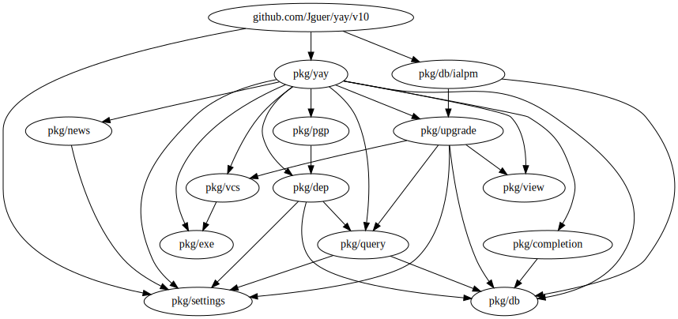

***
JAJ
***

Improve YAY
###########

Agenda
======

Goals
-----

1. Improve maintainability by
2. Adding tests and
3. Fixing bugs

Steps
-----

1. Reduce dependencies/coupling
2. Improve testability
3. Add tests
4. Larger architectural changes

Step 1
^^^^^^

* Reduce intra module dependencies

  completion -> db (not possible, but use a smaller interface) [done]

  settings -> vcs [done]

  intrange -> stringset (ParseNumberMenu should be moved) [done]

* Reduce extra module dependencies

  pkg/dep -> aur (via query) [done]

  most dependencies on alpm (via type alias in db) [done]

  most dependencies on gotext (move functionality into pkg/text) [done]

  pkg/upgrade -> alpm (add VerComp method to db) [done]

* Reduce standard library dependencies

  \* -> os and fmt (make pkg/text the destination for all user relevant output) [done]

settings

  parser.go: rpc.AURURL [done] (moved to main)

Split parsing off of settings [done]

Move settings/exe a level up (no cohesion with settings) [done]

Investigate merging putting Arguments inside Runtime [see below]
  settings will export three data structures

  1. yay configuration relevant options
  2. pacman configuration relevant options and an easy way to manipulate them
  3. misc options that are only of immediate relevancy [embeds yay config]

Make Runtime hold all high level dependencies [done]

Static data structures for pacman options [done]

Removed globals form settings package [done] (moved into db.Executor interface)

research argument handling of '-' (non-blocking read and reattach to console) [done]

Move Runtime into package main [done]

Add method to settings.YayConf isPacmanOp [done]

split parts off of main [done]
- split off most input and output handling
- [done] main does now only initialization and dispatch
- added yay and view package (should rename view, maybe put it in text?)

replace upgrade.UpSlice with []upgrade.Upgrade [done]

remove stringset.MapStringSet [done]

multierror add sync to Err [done]
multierror add Is and As [done]

split Runner and CmdBuilder [done]

news and completion -> net/http (create a http client in main and inject it) [done]

Future
------

More emphasis on pkg/exec. Needs to play well with pkg/text

go-srcinfo type alias in pgp/vcs?

remove dependency on pkg/errors

add context support

propagate cancellation

reduce db.Executor interface

add logging
- log commands executed

investigate required arguments of pacman options
- search did not need an argument, was target

move translatable constants to the top of files

split multierror up in collector and actual multierror

nicer option declaration in pkg/settings.
currently lots of places need to be touched: crate filed in struct, create enum, declare string mapping, declare if takes argument, add in parser

add default editor path (vim/nano)

Split this content up into
- README
- CHANGES
- ARCHITECTURE

exe: use context and string Builder instead of bytes Buffer

vcs: .Update intern concurrency

Coupling in yay
^^^^^^^^^^^^^^^

install.go: alpm.QuestionType and bit mask (move to pkg/db) [done]

query.go: alpm.PkgReasonExplicit (move to pkg/db) [done]

cmd.go: alpm.Version [reject]

query.go: rpc.SearchBy (move to pkg/query), what about ``By``? [reject]

install.go: go-srcinfo Parse file (maybe move to pgp)

Tests
-----

* pkg/db              [interface]

* pkg/vcs             [91%]
* pkg/stringset       [90%]
* pkg/settings/parser [84%]
* pkg/pgp             [90%]
* pkg/news            [94%]
* pkg/multierror      [100%]

* main                [22%]
* pkg/view            [39%]
* pkg/upgrade         [46%]
* pkg/text            [10%]
* pkg/settings        [18%]
* pkg/intrange        [42%]
* pkg/completion      [37%]
* pkg/exe             [36%]
* pkg/query           [25%]
* pkg/db/ialpm        [20%]

* pkg/yay             [1%]
* pkg/dep             []

Layers
------

Original::

    db: -
    intrange: -
    multierror: -
    stringset: -
    text: -

    completion: db, text
    exe: text

    vcs: exe, text

    settings: exe, text, vcs

    query: intrange, multierror, text, stringset, db, settings
    news: settings, text

    dep: query, text, db, stringset, settings
    upgrade: db, query, text, vcs, intrange

    pgp: dep, text

    main: *

Now::

    db: -
    intrange: -
    multierror: -
    stringset: -
    text: -
    
    completion: text db
    settings: text
    exe: text
    
    news: text settings
    query: intrange multierror stringset text settings db
    vcs: text exe
    
    dep: stringset text query settings db
    runtime: vcs exe settings db
    upgrade: intrange text vcs query db
    
    db/ialpm: text upgrade settings db
    pgp: text dep

    main: *

